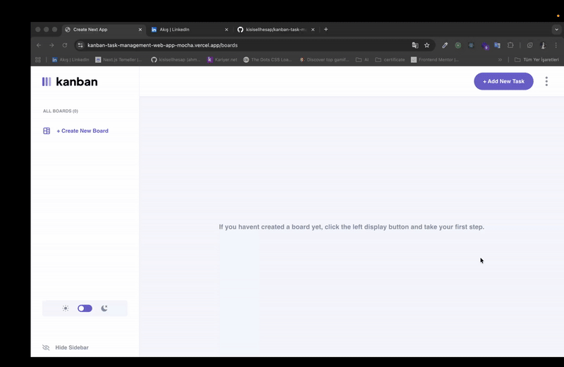

# 🎯 Kanban Task Management Web App

## 🌟 Overview

This project is a solution to the premium Frontend Mentor challenge: the **Kanban Task Management Web App**. It is a dynamic, fully-featured management application designed to help users organize their projects and tasks into **boards**, **columns**, and **tasks**. The application is built using **[Specify the Frontend Framework/Library you used]** and is optimized to be **responsive** across all device sizes.

---

## ✨ Key Features

The application provides robust capabilities essential for modern task management:

### 💼 Board and Task Management (CRUD)

- **Full Board CRUD:** Users can create new boards, edit existing ones, switch between different boards, and delete them.
- **Comprehensive Task CRUD:**
  - Create tasks and edit their title, description, and subtasks.
  - Mark subtasks as complete.
  - Delete tasks.
- **Status Update:** Update a task's status by moving it to a different column.
- **Form Validation:** Form validation warnings are implemented in the board and task modals for required fields.

### 🎨 User Interface and Experience

- **Responsive Design:** Optimal layout presentation for desktop, tablet, and mobile screens.
- **Theme Toggle:** Ability to switch between **Light** and **Dark** modes for user preference.
- **Sidebar Control:** Feature to hide and show the board sidebar to maximize workspace.
- **Persistent Data:** All boards and tasks persist even after the browser is refreshed, achieved via **[localStorage/Database]**.

## ⚡ Tech Stack

The project is built on the following core technologies, as detailed in `package.json`:

| Category             | Technology                          | Version              | Purpose                                                 |
| :------------------- | :---------------------------------- | :------------------- | :------------------------------------------------------ |
| **Frontend Core**    | **Next.js**                         | `^16.0.8`            | React Framework for production (App Router is assumed). |
| **UI Library**       | **React** / **React-DOM**           | `^19.2.1`            | Building user interfaces.                               |
| **Styling**          | **Tailwind CSS**                    | `^4`                 | Utility-first CSS framework.                            |
| **State Management** | **Redux Toolkit** / **React-Redux** | `^2.11.0` / `^9.2.0` | Centralized state management for boards and tasks.      |
| **Data Persistence** | **Redux-Persist**                   | `^6.0.0`             | Persisting the Redux store state in local storage.      |
| **Animations**       | **Framer Motion**                   | `^12.23.24`          | Implementing smooth, production-ready animations.       |
| **Theming**          | **next-themes**                     | `^0.4.6`             | Handling Light/Dark mode transitions.                   |
| **Language**         | **TypeScript**                      | `^5`                 | Ensuring type safety and code quality.                  |

Live:https://kanban-task-management-web-app-mocha.vercel.app/boards
Github: https://github.com/kisisellhesap/kanban-task-management-web-app

Kanban Task Management Web App

I’m excited to share my latest project — a fully featured Kanban Task Management Web App designed to streamline project and task organization. With a clean UI, responsive layout, and robust functionality, this app aims to deliver an efficient and intuitive workflow experience.

🔧 Key Features

✔️ Board & Task Management (CRUD)

- Create, edit, delete, and switch between boards.

- Add and edit tasks with descriptions and subtasks.

- Mark subtasks as complete.

- Delete tasks with confirmation flow.

- Move tasks across columns to update their status.

- Built-in form validation for required fields.

🎨 User Interface & Experience

- Fully responsive design across desktop, tablet, and mobile.

- Light / Dark theme toggle for user preference.

- Collapsible sidebar to maximize the workspace.

- Persistent data storage so boards and tasks remain intact even after page refresh.

🛠️ Tech Stack

This project is built using a modern and production-ready technology suite:

- Next.js 16 – React framework with App Router

- React 19 – UI layer

- Tailwind CSS 4 – Utility-first styling

- Redux Toolkit & React-Redux – Centralized state management

- Redux-Persist – Local storage persistence

- Framer Motion – Smooth, dynamic animations

- next-themes – Light/Dark mode handling

- TypeScript – Type-safe and scalable development

Live:https://kanban-task-management-web-app-mocha.vercel.app/boards
Github: https://github.com/kisisellhesap/kanban-task-management-web-app
